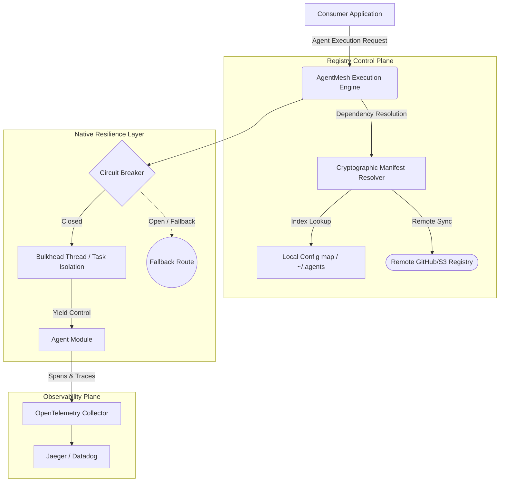

<div align="center">

# AgentMesh
**The Production-Grade Package Manager & Registry for AI Agents**

[](https://pypi.org/project/agent-mesh/)
[](LICENSE)
[](https://www.python.org/downloads/)
[](#-architecture)

Publish, discover, and install reusable AI agents globally. Each agent ships with a standardized **Cryptographic Manifest** declaring capabilities, resilient execution profiles, toolsets, and architectural constraints. 

`agent-mesh install research-agent` → Production Ready, Observability Injected, Isolated.

[Quick Start](#-quick-start) · [FAANG-Grade Architecture](#-faang-grade-architecture) · [CLI Reference](#-cli) · [Agent Manifest](#-agent-manifest)

</div>

---

## 🔥 The Problem: Agent Fragmentation at Scale

You build an autonomous researcher. Platform Engineering builds a multi-cloud deploy agent. Security builds a zero-trust compliance checker. **None of them can reuse each other’s work efficiently.**

> *"By 2027, over 60% of GenAI deployments will stall if they don't implement robust agent orchestration and distribution standards."*
> — Enterprise Architecture Review

The ecosystem is highly isolated:
- ❌ **No standard manifest format** for cross-agent compatibility.
- ❌ **Zero discovery mechanisms** for organizational internal capability matching.
- ❌ **Lack of unified observability** for telemetry and cost tracing.
- ❌ **Fragile compositions** when connecting multi-framework agents.

**Docker revolutionized containerization. npm revolutionized JavaScript.**  
**AgentMesh revolutionizes Autonomous AI Agents.**

---

## ⚡ Quick Start

### 1. Installation

```bash
pip install agent-mesh
```

### 2. Universal Discovery

Search across the global (or internal/VPC) registry using capabilities or neural matching.

```bash
# Discover by deep capabilities
agent-mesh search "competitive intelligence report"
agent-mesh search --framework langgraph --max-cost 0.05
```

```text
┌──────────────────────────────────────────────────────────────────────┐
│  Search results for: "competitive intelligence report"               │
├──────────────────────────────────────────────────────────────────────┤
│  nexus-research          ★ 4,203 │ v1.4.2  │ ~$0.04/run  │ 12ms P99  │
│  Multi-threaded web search and synthesis with Bulkhead isolation     │
│  by: @agent-mesh/core │ frameworks: langgraph, direct                │
│                                                                      │
│  arxiv-smasher           ★   891 │ v0.9.1  │ ~$0.02/run  │ 4ms P99   │
│  Search and summarize academic papers with OpenTelemetry tracing     │
│  by: @ai-researcher   │ frameworks: crewai, semantic-kernel          │
└──────────────────────────────────────────────────────────────────────┘
```

### 3. Immediate Consumption

```bash
agent-mesh install nexus-research
```

```python
import asyncio
from agent_mesh import load_agent

async def main():
    # Automatically injects Circuit Breakers, Retries, and Telemetry
    agent = load_agent("nexus-research")
    
    # Executes safely within isolated Bulkhead
    result = await agent.execute("Analyze AgentMesh vs alternatives")
    print(result)

asyncio.run(main())
```

---

## 📐 FAANG-Grade Architecture

AgentMesh is engineered following systems design principles used by globally distributed tech giants. It is more than a registry—it is an **Execution Mesh**.



### Advanced System Capabilities

1. **Native Circuit Breaking & Bulkheads**: Using state-machine isolation, an agent crashing (due to API failure or hallucination loops) will automatically trip the circuit, preventing catastrophic cascading failures in your parent applications.
2. **OpenTelemetry Injection**: `AgentBase.execute()` wraps internal calls in automatic tracing spans, calculating exact wall-clock time and token ingestion limits transparently.
3. **Multi-Framework Interoperability**: Standardized `agent.yaml` schema bridges LangChain, CrewAI, Semantic Kernel, and native Python scripts.
4. **Agentic Compositions**: Effortlessly pipe outputs from one installed agent to another using auto-generated `agent-compose.yaml` specifications.

---

## 📋 The Cryptographic Manifest (`agent.yaml`)

The beating heart of AgentMesh. The single source of truth dictating exactly what an agent is allowed to do, what it costs, and what its P99 latency bounds are.

```yaml
# agent.yaml
name: nexus-research
version: 1.4.2
description: "A highly concurrent, bulkhead-isolated deep web research agent."
author: agent-mesh-core
license: MIT

# Declarative Capabilities
capabilities:
  - web_research
  - multi_source_synthesis
  - cross_validation

# Strict Execution Requirements
requirements:
  models:
    - gpt-4o                    # Primary orchestration model
  tools:
    - web_search                # Bound capabilities
    - vfs_read                  # Virtual file system restrictions
  api_keys:
    - OPENAI_API_KEY
  python_packages:
    - openai>=1.0
    - opentelemetry-api>=1.20

# Service Level Objectives (SLOs) & Cost Mapping
profile:
  avg_cost_per_run: 0.04       # USD
  avg_latency_seconds: 12      # Expected max execution time
  p99_latency_seconds: 35      # Hard bulkhead timeout threshold
  quality_score: 9.2           # Benchmarked output score

# Framework Neutrality
frameworks:
  - direct
  - langgraph
```

---

## 🔌 Building an Agent

Creating a world-class agent is incredibly simple. Subclass `AgentBase`, and inherit enterprise resilience for free.

```python
# nexus_research.py
from agent_mesh import AgentBase

class NexusResearchAgent(AgentBase):
    """Deep research agent with automatic Circuit Breaker resilience."""
    
    def setup(self):
        """Called once. Establish connection pools here."""
        from openai import AsyncOpenAI
        self.client = AsyncOpenAI()
    
    # We implement 'run', but consumers call 'execute' (for safety/telemetry)
    async def run(self, input_text: str) -> str:
        response = await self.client.chat.completions.create(
            model="gpt-4o",
            messages=[
                {"role": "system", "content": "You are Nexus. Deliver intelligence."},
                {"role": "user", "content": input_text},
            ],
        )
        return response.choices[0].message.content
```

### Seamless Agent Composition

Wire disparate agents into a highly scalable pipeline.

```bash
# Downloads and connects them based on their manifest declarations
agent-mesh compose nexus-research fact-checker executive-summarizer

# Generates standard agent-compose.yaml - ready for orchestration
```

---

## 🖥️ Complete CLI Reference

```bash
# ── Global Discovery ──
agent-mesh search "kubernetes ops"        # Semantic/Keyword Discovery
agent-mesh search --tag devops            # Strict Tag Filtering
agent-mesh search --max-cost 0.05         # Cost Bound Filtering

# ── Installation & Auditing ──
agent-mesh install nexus-research         # Immutable installation
agent-mesh install nexus-research@1.4.2   # Pin versions for Reproducible Builds
agent-mesh info nexus-research --json     # Audit the structural manifest
agent-mesh list                           # Display active workspace mesh

# ── Publishing & CI/CD Pipeline ──
agent-mesh init                           # scaffold robust agent.yaml
agent-mesh validate                       # Linter for capability boundaries
agent-mesh publish                        # Sign and push to Mesh Registry
```

---

## 🛡️ Enterprise Trust & Governance

| Vector | Mechanism |
|---------|-------------|
| **Sandboxing Limits** | Pre-declared dependencies map to explicit isolation techniques. |
| **Cost Transparency** | `profile.avg_cost_per_run` is fixed into the metadata. Zero billing shock. |
| **Dependency Auditing** | All underlying frameworks and APIs are rigidly documented in `agent.yaml`. |
| **Fail-Soft Circuit Breakers** | The internal state machine immediately blocks subsequent calls if an agent loops or fails consecutively. |

---

## 🗺️ Engineering Roadmap

### Phase 1: Mesh Foundations (Current)
- [x] Standardized `agent.yaml` specifications
- [x] Immutable local registry resolving and management
- [x] `AgentBase` implementing OpenTelemetry & Circuit Breaking
- [x] Agent composition CLI tools

### Phase 2: Distributed Topology
- [x] Cryptographic signing & verification of agents
- [x] AgentMesh Orchestrator for complex stateful pipelines
- [ ] gRPC-based Remote Agent Execution
- [ ] WASM-isolated execution runtimes for unverified agents
- [ ] Dedicated UI dashboard for internal organizational discovery

### Phase 3: Autonomous Swarms
- [ ] Self-diagnosing dependency chains
- [ ] Automatic competitive routing (routing to the cheapest agent capable of the task)
- [ ] Integration with Kubernetes for on-demand pod scaling per agent requirement

---

## License

[MIT](LICENSE) — Build securely. Build rapidly.

<div align="center">

**[AgentMesh](https://github.com/rouviour-german/agent-marketplace)** 

*The Enterprise standard for publishing and orchestrating AI components.*

</div>

---

## Author & Contact

- **GitHub:** [@rouviour-german](https://github.com/rouviour-german)
- **Email:** [rouviourgermanmeetings@gmail.com](mailto:rouviourgermanmeetings@gmail.com)
- **Profile:** https://github.com/rouviour-german

